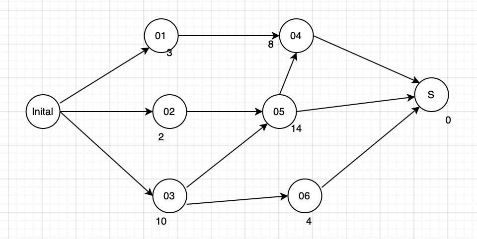
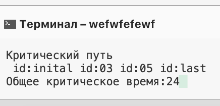

# Лаб 4 
Динамическое планирование задач. 

Критический путь в графе это расстояние между вершиной и конечной вершиной. Длинна этого пути - критическое время. Каждая вершина имеет свойство: критическое время

Поиск критического пути - нахождение максимального пути между связанными вершинами.

## Условие задания
Направленный ацикличный граф (вершина - задание с указанным временем выполнения duration)

## Результат

Результат - критический путь и общее критическое время.

